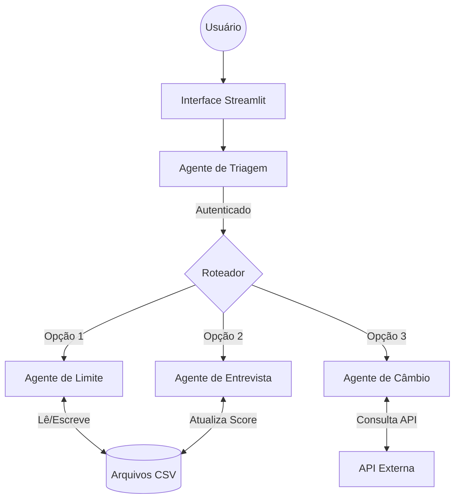

# Test_AI

# Sistema de Agentes de Crédito Inteligente

## 1. Visão Geral do Projeto
Este projeto consiste em um sistema inteligente de gestão de crédito composto por múltiplos agentes autônomos. O objetivo é automatizar o atendimento ao cliente bancário, oferecendo serviços como consulta e aumento de limite, atualização cadastral via entrevista e consulta de taxas de câmbio, tudo através de uma interface unificada e amigável.

## 2. Arquitetura do Sistema

O sistema foi desenhado seguindo uma arquitetura modular baseada em agentes, onde cada componente possui uma responsabilidade única.

### Diagrama de Fluxo


### Componentes e Fluxo de Dados
*   **Agente de Triagem**: Responsável pela segurança. Recebe o CPF e Data de Nascimento, valida contra a base de dados (`clientes.csv`) e gerencia a sessão do usuário.
*   **Agente de Limite**: Analisa o perfil financeiro. Lê o score do cliente e as regras de negócio (`score_limite.csv`) para aprovar ou rejeitar aumentos de limite automaticamente. Registra todas as tentativas em log (`solicitacoes_aumento_limite.csv`).
*   **Agente de Entrevista**: Realiza a análise de risco. Coleta dados atualizados (renda, despesas, etc.) e utiliza um algoritmo ponderado para recalcular o score do cliente, salvando o novo valor na base.
*   **Agente de Câmbio**: Conecta-se com o mundo exterior. Consome a API `open.er-api.com` para fornecer cotações de moedas em tempo real.

## 3. Funcionalidades Implementadas
*   **Autenticação Segura**: Login com validação de dados cadastrais.
*   **Gestão de Limite de Crédito**:
    *   Visualização de limite e score atual.
    *   Solicitação de aumento com aprovação imediata baseada em regras.
    *   Log automático de solicitações.
*   **Entrevista de Crédito Interativa**:
    *   Formulário dinâmico para atualização de dados.
    *   Cálculo automático de novo score baseado em múltiplos fatores (renda, emprego, dependentes).
*   **Conversor de Moedas**: Consulta de taxas de câmbio em tempo real.
*   **UX Aprimorada**:
    *   Formatação automática de moeda (R$ 1.000,00) enquanto o usuário digita/confirma.
    *   Seleção de data intuitiva.

## 4. Desafios Enfrentados e Soluções

| Desafio | Solução Adotada |
|---------|-----------------|
| **Formatação de Input no Streamlit** | O Streamlit padrão usa ponto para decimais. Criamos um componente customizado (`currency_input`) que intercepta o valor e aplica a formatação brasileira (vírgula para decimais, ponto para milhares) visualmente, mantendo o float correto no backend. |
| **Persistência de Estado** | Manter o usuário logado ao navegar entre diferentes "telas" (agentes). Utilizamos o `st.session_state` para persistir o objeto do usuário e o status de autenticação entre os *reruns* da aplicação. |
| **Integração de Agentes** | Fazer com que códigos isolados (scripts Python) funcionassem numa interface web única. Refatoramos a lógica dos agentes para funções reutilizáveis e criamos uma camada de *View* no Streamlit que consome essas funções. |

## 5. Escolhas Técnicas e Justificativas

*   **Python**: Escolhido pela sua robustez em manipulação de dados e facilidade de prototipagem.
*   **Streamlit**: Selecionado para o Frontend por permitir a criação de interfaces de dados ricas e interativas com poucas linhas de código, ideal para validação rápida de conceitos (MVP).
*   **Arquitetura de Arquivos (CSV)**: Optamos por usar arquivos CSV como banco de dados para simplificar a execução do projeto. Isso elimina a necessidade de o avaliador instalar servidores SQL (MySQL/Postgres), garantindo que o projeto rode em qualquer máquina apenas com Python.
*   **API Open Exchange**: Escolhida por ser gratuita, pública e não requerer chaves de API complexas para demonstração.

## 6. Tutorial de Execução e Testes

### Pré-requisitos
*   Python 3.8 ou superior instalado.

### Passo a Passo
1.  **Clone ou baixe o projeto** para sua máquina.
2.  **Instale as dependências**:
    Abra o terminal na pasta do projeto e execute:
    ```bash
    pip install -r requirements.txt
    ```
3.  **Execute a aplicação**:
    ```bash
    streamlit run streamlit_app.py
    ```
4.  **Acesse no Navegador**:
    O sistema abrirá automaticamente em `http://localhost:8501`.

### Como Testar
*   **Login**: Use um CPF que esteja no arquivo `data/clientes.csv` (ex: verifique o arquivo para pegar um válido).
*   **Teste de Limite**: Tente pedir um aumento absurdo para ver a rejeição, e um aumento modesto para ver a aprovação.
*   **Teste de Formatação**: Digite valores monetários e veja a mágica das vírgulas acontecer.
